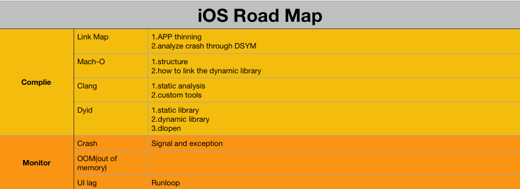

# iOSRoadMap

##### 1.iOS 基础

1.1 [UI 视图](./articles/UI视图/UI.md)

1.4[runloop](./articles/runloop/runloop.md)

##### 2.进阶

2.1 [ App 启动速度怎么做优化与监控？](./articles/iOSFurtherDeve/02app启动速度怎么做优化与监控/App启动速度怎么做优化与监控.md)

2.5 [链接器：符号是怎么绑定到地址上的](./articles/iOSFurtherDeve/05链接器符号是怎么绑定到地址上的/符号是怎么绑定到地址上的.md)

2.6 [注入动态库式实现极速编译调试](./articles/iOSFurtherDeve/06注入动态库式实现极速编译调试/注入动态库式实现极速编译调试.md )

2.7[代码的静态分析](./articles/iOSFurtherDeve/07代码的静态分析/07代码的静态分析.md )

2.8[利用Clang为APP提质](./articles/iOSFurtherDeve/08利用Clang为APP提质/利用Clang为APP提质.md)

2.12[全面监听崩溃](./articles/iOSFurtherDeve/12全面监听崩溃/全面监听崩溃.md )

2.13[使用RunLoop原理监控卡顿](./articles/iOSFurtherDeve/13使用RunLoop原理监控卡顿/使用RunLoop原理监控卡顿.md )

2.14[OOM，获取内存分配信息](./articles/iOSFurtherDeve/14OOM获取内存分配信息/OOM获取内存分配信息.md )

2.17[多线程的坑](./articles/iOSFurtherDeve/17多线程的坑/17多线程的坑.md )

##### 3.tips and tricks

3.1[打印动态链接器事件命令](./articles/tipsAndTricks/001loggingDYLDevents.md)

3.2[关于库信息](./articles/tipsAndTricks/002库信息/关于库的信息.md)

3.3[Cocoapods](./articles/tipsAndTricks/003cocoapods/Cocoapod.md)

