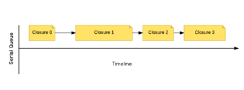
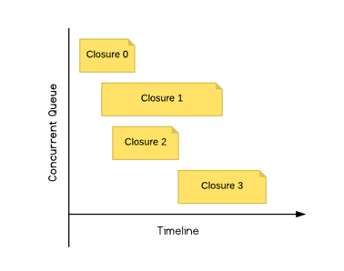

## GDC

### 1.队列

#### 1.1serial

串行队列，最先执行压入任务（闭包）栈的任务，直到该任务结束，才会执行下一个。




#### 1.2concurrent

并发队列，当把任务压入任务栈后，系统会在正确的线程中去执行它。




### 2.派发办法

#### 2.1sync

只有当当前的任务执行完毕才返回，因此会阻塞当前的队列。

#### 2.2async

执行任务时会立马返回，不会等任务执行完毕，因此不会阻塞当前的队列。

### 3.死锁组合

死锁：争夺资源，互相等待。

##### case1：

```objective-c
- (void)caseone{
    NSLog(@"1");
    dispatch_sync(dispatch_get_main_queue(), ^{
        NSLog(@"2");
    });
    
    NSLog(@"3");
}
```

任务栈：任务1，任务3，任务2

当执行完任务1，执行任务2，由于同步，任务2必须等待同队列的任务3执行完，然而任务3在等任务2执行，任务2和任务3互相等待，造成死锁。

整个函数的视为一个大任务压进任务栈，此时占领了一个信号量。在执行大任务的时候，其中自任务有压进这个队列中，并要求信号量来执行子任务。此时已经没有信号给子任务执行了，大任务没发执行完任务，无法释放信号量，所以造成了死锁。

##### case2:

```objective-c
- (void)caseTwo{
    NSLog(@"1");
    dispatch_queue_t serialQueue = dispatch_queue_create("dd", DISPATCH_QUEUE_SERIAL);
    dispatch_async(serialQueue, ^{
        NSLog(@"%p",[NSThread currentThread]);
        NSLog(@"2");
    });
    sleep(2.0);
    NSLog(@"%p",[NSThread currentThread]);
    NSLog(@"3");
}
```

任务栈1：

##### case3:

```objective-c
- (void)caseTwo{
    NSLog(@"1");
    dispatch_queue_t serialQueue = dispatch_queue_create("dd", DISPATCH_QUEUE_SERIAL);
    dispatch_sync(serialQueue, ^{
        NSLog(@"%p",[NSThread currentThread]);
        NSLog(@"2");
    });
    sleep(2.0);
    NSLog(@"%p",[NSThread currentThread]);
    NSLog(@"3");
}
```

##### case4：

```objective-c
- (void)caseThree{
    NSLog(@"1");
    dispatch_sync(dispatch_get_global_queue(0, 0), ^{
        NSLog(@"2");
    });
    NSLog(@"3");
}
```

##### case5:

```objective-c
- (void)deadLockCase2 {
    NSLog(@"1");
    //3会等2，因为2在全局并行队列里，不需要等待3，这样2执行完回到主队列，3就开始执行
    dispatch_sync(dispatch_get_global_queue(DISPATCH_QUEUE_PRIORITY_HIGH, 0), ^{
        NSLog(@"2");
    });
    NSLog(@"3");
}
```

##### case6:

```objective-c
- (void)deadLockCase3 {
    dispatch_queue_t serialQueue = dispatch_queue_create("com.starming.gcddemo.serialqueue", DISPATCH_QUEUE_SERIAL);
    NSLog(@"1");
    dispatch_async(serialQueue, ^{
        NSLog(@"2");
//        //串行队列里面同步一个串行队列就会死锁
        dispatch_sync(serialQueue, ^{
            NSLog(@"3");
        });
        NSLog(@"4");
    });
    NSLog(@"5");
}
```

##### case7:

```objective-c
- (void)viewDidLoad {
    [super viewDidLoad];
    
    dispatch_async(dispatch_get_main_queue(), ^{
        NSLog(@"11");
        dispatch_queue_t serialQueue = dispatch_queue_create("test", DISPATCH_QUEUE_SERIAL);

        dispatch_queue_t secondQueue = dispatch_queue_create("com.starming.gcddemo.secondqueue", DISPATCH_QUEUE_CONCURRENT);
        dispatch_sync(secondQueue, ^{
            NSLog(@"2");
        });
    });
}
```

##### case8:

```objective-c
- (void)viewDidLoad {
    [super viewDidLoad];
    
    dispatch_async(dispatch_get_main_queue(), ^{
        NSLog(@"11");
        dispatch_queue_t serialQueue = dispatch_queue_create("test", DISPATCH_QUEUE_SERIAL);
        dispatch_sync(serialQueue, ^{
            NSLog(@"2");
        });
    });
}
```

### 4根据系统状况来执行任务

#### 4.1dispatch_apply

```objective-c
//因为可以并行执行，所以使用dispatch_apply可以运行的更快
- (void)dispatchApplyDemo {
    dispatch_queue_t concurrentQueue = dispatch_queue_create("com.starming.gcddemo.concurrentqueue", DISPATCH_QUEUE_CONCURRENT);
    dispatch_apply(10, concurrentQueue, ^(size_t i) {
        NSLog(@"%zu",i);
    });
    NSLog(@"The end"); //这里有个需要注意的是，dispatch_apply这个是会阻塞主线程的。这个log打印会在dispatch_apply都结束后才开始执行
}
```


#### 4.2dispatch_group

##### 4.2.1normal

##### 4.2.2priority

```objective-c
- (void)groupWithPriority{
    dispatch_group_t groupe = dispatch_group_create();
    dispatch_queue_t highQueue = dispatch_get_global_queue(DISPATCH_QUEUE_PRIORITY_HIGH, 0);
    dispatch_queue_t lowQueue = dispatch_get_global_queue(DISPATCH_QUEUE_PRIORITY_LOW, 0);
    
    
    
    dispatch_group_async(groupe, lowQueue, ^{
        NSLog(@"thread address:%p / takeNum:%d",[NSThread currentThread],2);
    });
    dispatch_group_async(groupe, highQueue, ^{
        sleep(10);
        NSLog(@"thread address:%p / takeNum:%d",[NSThread currentThread],1);
    });
    
    //case1
//    dispatch_group_notify(groupe, dispatch_get_main_queue(), ^{
//        NSLog(@"task finished,update user interface");
//    });
    //case2
    dispatch_group_wait(groupe, DISPATCH_TIME_FOREVER);
    NSLog(@"task finished,update user interface");
}
```


#### 4.3dispatch_semaphore

```objective-c
- (void)semaphore{
    dispatch_queue_t queue = dispatch_get_global_queue(DISPATCH_QUEUE_PRIORITY_DEFAULT, 0);
    dispatch_semaphore_t semaphore = dispatch_semaphore_create(1);
    
    NSMutableArray *array = [NSMutableArray array];
    for (int i = 0; i < 100; i++) {
        dispatch_async(queue, ^{
            dispatch_semaphore_wait(semaphore, DISPATCH_TIME_FOREVER);
            NSLog(@"taskName:%d",i);
            [array addObject:[NSNumber numberWithInt:i]];
            dispatch_semaphore_signal(semaphore);
        });
    }
}
```

