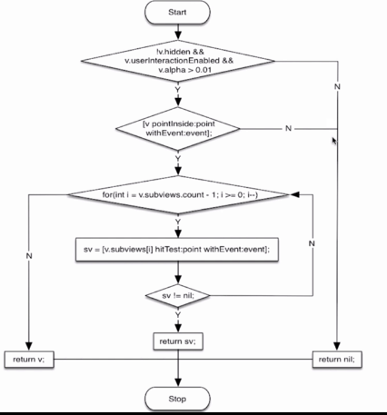
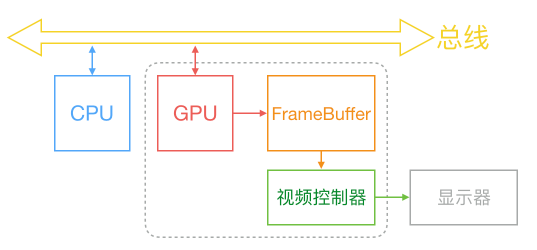
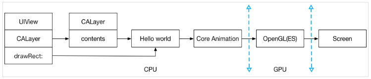
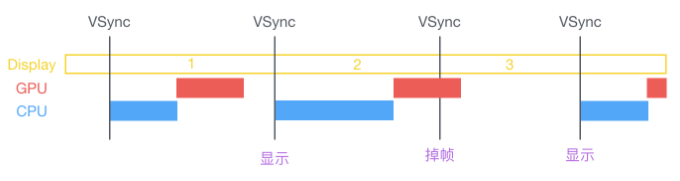
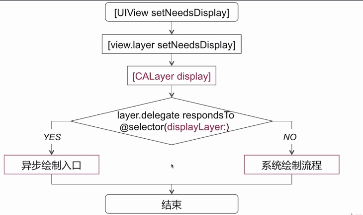
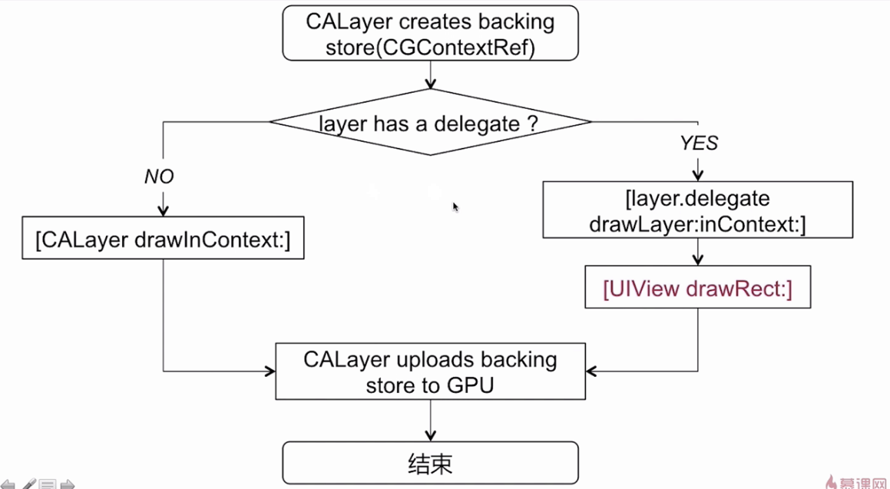
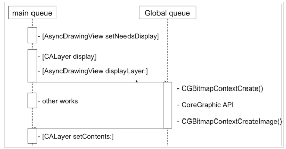

###UI视图

#### 1.UITableView

##### 1.1 重用机制

+ 字母索引条  

##### 1.2 数据源

+ 数据源同步：并发访问 & 串行访问

#### 2. UI事件传递和响应

##### 2.1 UIView 和 CALayer

+ 单一原则，设计模式（负责相应的功能）
+ UIView 响应链
+ CALayer 显示内容，contents

##### 2.2 事件传递流程

subView -> view - > UIWindow -> UIApplication -> UIDelegate

Many key objects are also responders, including the [`UIApplication`](https://developer.apple.com/documentation/uikit/uiapplication?language=objc)object, [`UIViewController`](https://developer.apple.com/documentation/uikit/uiviewcontroller?language=objc) objects, and all [`UIView`](https://developer.apple.com/documentation/uikit/uiview?language=objc) objects (which includes [`UIWindow`](https://developer.apple.com/documentation/uikit/uiwindow?language=objc)). As events occur, UIKit dispatches them to your app's responder objects for handling.




响应链的应用：

+ ```
  - hitTest:withEvent:
  指定想要响应事件的 View, 比如点击的是 A ，可以指派 B 来响应。
  
  ```

  ```
  - pointInside:withEvent:
  控制响应的范围，扩大 or 缩小。
  ```

下一步：

测试这两个API

#### 3 图像显示原理

CPU 与 GPU 是通过总线链接起来，通过 CPU 输出一个 bitmap，经由总线在合适的时机传递到 GPU ，GPU 获取到 bitmap 进行图层渲染，纹理合成，将最后的结果放入帧缓冲区，由视频控制器根据 VSyn （vertical synchronization）信号(由硬件产生的时钟信号，iPhone 真机一般是59.97)，在指定的时间之前提取帧缓存区中的屏幕显示内容，最终显示在屏幕上。




CPU与GPU分别做了什么？

创建UIView后，显示部分由CALayer负责，CALayer有一个contents属性，就是我们最终要绘制到屏幕上的位图，如果我们创建的是UILabel，那么contents上最终要绘制就是“Hello”的位图,系统在合适的时候回调给我们一个drawRect的方法，然后我们可以在此基础上绘制一些我们想自定义绘制的内容，绘制好的这个位图，会经过Core Animation提交给GPU部分的OpenGL渲染管线，进行最终的位图的渲染以及纹理的合成，最终显示到屏幕上。




CPU：layout（UI布局，文本计算），display（绘制 drawRect）,prepare(图片解码)，commit（提交位图）

GPU：顶点着色，图元装配，光栅化，片段着色，片段处理，最后提交帧缓冲区

[更多知识传送门](https://blog.ibireme.com/2015/11/12/smooth_user_interfaces_for_ios/)

#####3.1 UI卡顿，掉帧原因




60FPS 肉眼看起来UI 是流畅的，这就意味着 1.67ms 就需要完成一帧图，卡顿原因便是 CPU & GPU 协同超出每一帧的数据超出了这个时间界限。

CPU：对象创建，调整，销毁放置子线程，预排版（布局计算，文本计算）， 预渲染（文本等异步绘制，图片编解码等）

GPU：纹理渲染，视图混合

#####3.2 UIView 绘制视图原理

`[UIView setNeedsDisplay] `并没有发生当前视图立即绘制工作,打上需要重绘的脏标记，最后是在某个时机完成。[官方传送门](https://developer.apple.com/documentation/uikit/uiview/1622437-setneedsdisplay)

具体发生流程如下：




当 runloop 要结束的时候，才会调用`[CALayer display]` 。

系统绘制流程：




异步绘制：

[layer.delegate displayLayer:];

+ 代理负责生成对应的 bitmap

+ 设置该 bitmap 作为 layer.contents  属性的值

  


扩展：

	1.[UIView layoutIfNeeded] 立即重新布局视图
	
	2.[UIView setNeedsLayout] 将当前视图布局弃用，在下一个更新循环来时更新视图布局。

##### 3.3 离屏渲染

什么是？

	GPU 在当前屏幕缓冲区以外开辟一个缓冲区进行渲染操作。当我们设置某一些UI视图显示，如果在未合成之前无法显示，则会发生离屏渲染。

哪些情况？

+ 设置圆角 + maskToBounds
+ 光栅化
+ 阴影
+ 图层蒙版

为什么要避免？

开辟新的渲染缓冲区，上下文的切换，增加 GPU 处理工作量和时间，可能导致CPU & GPU 协作耗时超过UI流畅时间，导致UI卡顿，掉帧。


扩展：

	maskToBounds：指的是视图的图层（CALayer）上的子图层，如果超出父图层的部分就街去掉。
	
	clipsToBounds (UIView) ：视图上的子视图，如果超出父视图的部分就被截掉。
	
	但从这一块来说，clipsToBounds 执行的时候，调用了自己的图层的 maskToBounds 办法。
	
	为什么说设置圆角 +  maskToBounds 才会发生光栅化？
	
	当一个 view 上没有任何子视图的时候，设置圆角，没有子view 超出父类的内容，所以也不会有图层合并，故不会发生光栅化。

