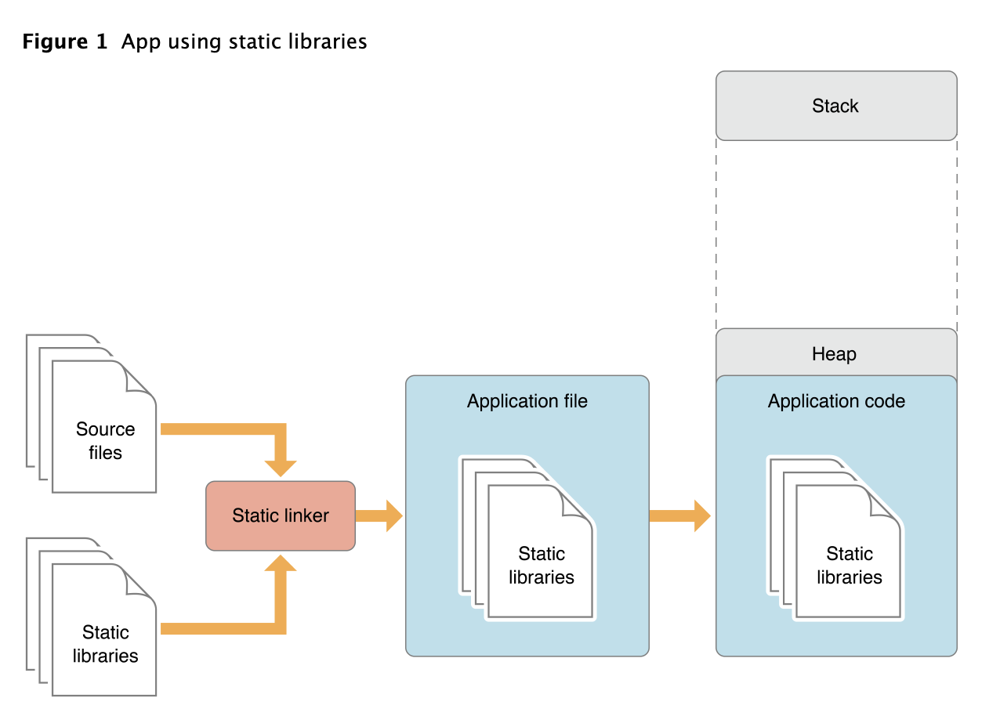
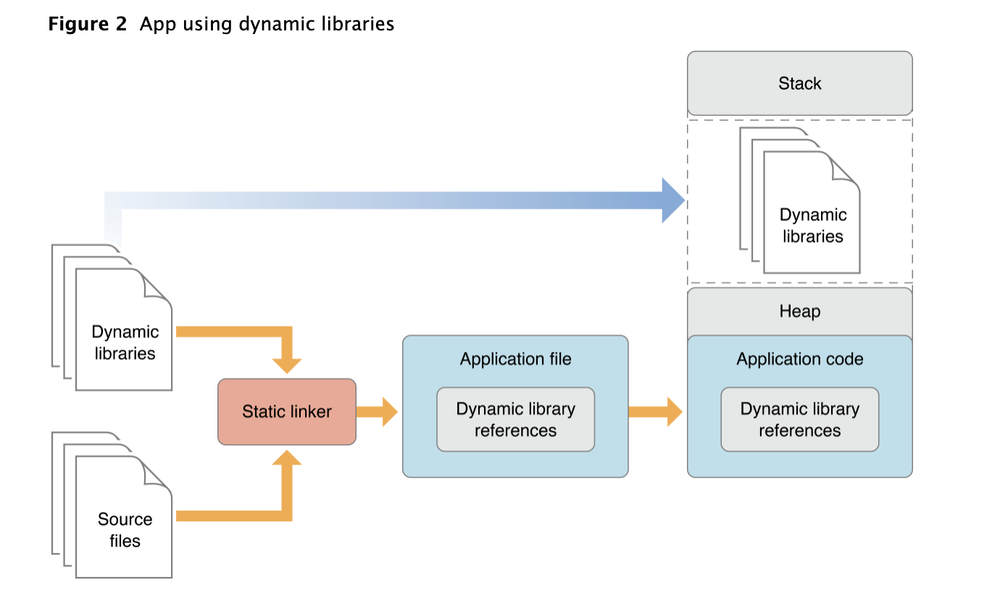

#02 | App 启动速度怎么做优化与监控？

##### 1.冷启动/热启动

##### 2.进程/线程

一个 application 是一个进程，一个进程可以包含多个线程。

##### 3.可执行文件, Link Map File

######3.1 格式？

.o 文件 (目标文件)

.a 静态库

[对Link Map File的初步认识](<http://sparkgis.com/2018/11/20/%E5%AF%B9link-map-file%E7%9A%84%E5%88%9D%E6%AD%A5%E8%AE%A4%E8%AF%86/>)

[一个demo](./linkMapFile.txt )

######3.2 可执行文件中做了些什么？

全局变量，类名，办法名等等，那么需要清楚他的整体结构。

######3.3 作用

A link map file is a text file that details where data, code, etc lives inside your executable. Very handy for stack traces when your program crashes, and for examining memory.

Just ask Xcode to make one, and then open it in textedit or whatever. You'll see all your method names and variable names, alongside addresses.

If you submit your app to the app store, it's vital you keep your map file, so if Apple manage to crash your app, you'll stand a better chance of making head or tail of the crash report.

（1）可以根据崩溃栈信息来对应地址找到相应的办法

（2）可以瘦身

######3.4 可执行文件瘦身：

[瘦身](https://www.cnblogs.com/fengmin/p/5631781.html)

[Linkmap 分析工具](https://github.com/huanxsd/LinkMap) （下一步：看懂实现原理和动手实现一个）

######3.5 crash 分析

[简书crash分析](https://www.jianshu.com/p/16b680d45e09)

[官方](<https://developer.apple.com/library/archive/technotes/tn2151/_index.html#//apple_ref/doc/uid/DTS40008184-CH1-APPINFO>)

代码混淆：

<https://github.com/chenxiancai/STCObfuscator>

##### 4.动态库

######4.1 什么是动态库？

WWDC2014，Xcode6 beta 发布。

*Frameworks for iOS. iOS developers can now create dynamic frameworks. Frameworks are a collection of code and resources to encapsulate functionality that is valuable across multiple projects. Frameworks work perfectly with extensions, sharing logic that can be used by both the main application, and the bundled extensions.*

######4.2 动态库和静态库的区别

静态库的后缀名是以`.a`结尾，动态库的后缀名可以是`.dylib`或`.framework`结尾，所有的系统库都属于动态库，在iOS中一般使用framework作为动态库。

下面是apple官方的两张图，表示app启动后内存的使用情况，很形象的说明了静态库和动态库的区别

使用静态库的app



 使用动态库的app 



在使用static linker链接app时，静态库会被完整的加载到app的mach-o文件（上图中的Application file）中，作为mach-o文件的一部分，而动态库不会被添加到mach-o文件中，这可以有效减少mach-o文件的大小。 如果app将动态库作为它的依赖库，则在mach-o文件中会添加了一个动态库的引用；如果app在运行时动态加载动态库，则在mach-o文件中不会添加动态库的引用。

在使用app时，静态库和动态库都会被加载到内存中。当多个app使用同一个库时，如果这个库是动态库，由于动态库是可以被多个app的进程共用的，所以在内存中只会存在一份；如果是静态库，由于每个app的mach-o文件中都会存在一份，则会存在多份。相对静态库，使用动态库可以减少app占用的内存大小。

另外，使用动态库可以缩短app的启动时间。原因是，使用动态库时，app的mach-o文件都会比较小；app依赖的动态库可能已经存在于内存中了（其他已启动的app也依赖了这个动态库），所以不需要重复加载。

The downside of using a static library is that it’s code is locked into the final executable file and cannot be modified without a re-compile. In contrast, a dynamic library can be modified without a need to re-compile.

|                    | static libraries | dynamic libraries |
| :----------------: | :--------------: | :---------------: |
| 包含于可执行文件中 |  是（所有文件）  | 否（仅映射文件）  |
|  多个应用之间关系  |      一对一      |      一对多       |
|   运行时执行速度   |        快        |        慢         |
|  是否需要重新编译  |        是        |        否         |

[Static Libraries vs. Dynamic Libraries](<https://medium.com/@StueyGK/static-libraries-vs-dynamic-libraries-af78f0b5f1e4>)

######4.3 动态库是如何运用的？

动态库允许一个应用在实际需要的时候加载一段代码到它的地址空间中去，这既可以在应用启动时或者运行时完成。动态库并不是应用的二进制文件的一部分。
 当一个app启动后，app的代码最先被加载到进程的地址空间，然后动态链接器`dynamic loader` - 在苹果的平台上即是`dyld`，接管进程并加载相关的库。这里面包括解析他们在文件系统上的位置（基于他们安装时候的名字），并解析app需要的未定义的外部符号`external symbols`。在运行时`dynamic loader`也将会加载哪些被请求的其他库。

执行 Mach-O 文件

[Executing Mach-O Files](<https://developer.apple.com/library/archive/documentation/DeveloperTools/Conceptual/MachOTopics/1-Articles/executing_files.html#//apple_ref/doc/uid/TP40001829>)

[深入剖析iOS动态链接库](https://www.jianshu.com/p/1de663f64c05)

4.4 动态库的制作和使用流程

（1）版本更新，API 的兼容

One issue that developers must keep in mind when developing dynamic libraries is maintaining compatibility with client apps as a library is updated. Because a library can be updated without the knowledge of the client-app’s developer, the app must be able to use the new version of the library without changes to its code. To that end, the library’s API should not change. However, there are times when improvements require API changes. In that case, the previous version of the library must remain in the user’s computer for the client app to run properly. [Dynamic Library Design Guidelines](https://developer.apple.com/library/archive/documentation/DeveloperTools/Conceptual/DynamicLibraries/100-Articles/DynamicLibraryDesignGuidelines.html#//apple_ref/doc/uid/TP40002013-SW19) explores the subject of managing compatibility with client apps as a dynamic library evolves.

[官方](<https://developer.apple.com/library/archive/documentation/DeveloperTools/Conceptual/DynamicLibraries/100-Articles/OverviewOfDynamicLibraries.html>)

######4.5 作用

是否可以通过动态库动态更新UI or function?

##### 5.+laod() +initialize()

+ Load: 当类或是分类添加到 runtime 时就会调用，但是仅初次才会响应；先调用子类的，分类的后于类的调用
+ initialize 是当类接收到消息才被调用，先调用父类，再子类；
+ 因为 initialize 是线程安全模式，在其完成之前所有其他线程发送的请求都会被屏蔽，所以该办法尽量只去实现必要内容；再者其容易发生死锁，所以最好只限制于比较直接和自身相关的一些初始化。
+ 使用场景：https://medium.com/@kostiakoval/load-vs-initialize-a1b3dc7ad6eb
+ 官方：https://developer.apple.com/documentation/objectivec/nsobject/1418639-initialize?language=objc

6.如何监控耗时

7.对象中的 metadata ？？

8.探究 objc_msgSend

##### 9.arm64 结构？

[iOS 中的概念](<https://www.jianshu.com/p/3fce0bd6f045>)

https://blog.nelhage.com/2010/10/amd64-and-va_arg/
http://infocenter.arm.com/help/topic/com.arm.doc.ihi0055b/IHI0055B_aapcs64.pdf
https://developer.apple.com/library/ios/documentation/Xcode/Conceptual/iPhoneOSABIReference/Articles/ARM64FunctionCallingConventions.html

#####10.汇编知识入门

汇编语言入门可以看阮一峰老师的《汇编语言入门教程》啊。链接是 http://www.ruanyifeng.com/blog/2018/01/assembly-language-primer.html 。以后可以考虑写个 iOS 视角的

#####11.Mach-O

我们用 Xcode 构建一个程序的过程中，会把源文件 (`.m` 和 `.h`) 文件转换为一个可执行文件。这个可执行文件中包含的字节码会将被 CPU (iOS 设备中的 ARM 处理器或 Mac 上的 Intel 处理器) 执行。

######11.1 结构

可以看的出 Mach-O 主要由 3 部分组成:

- Mach-O 头（Mach Header）：这里描述了 Mach-O 的 CPU 架构、文件类型以及加载命令等信息；
- 加载命令（Load Command）：描述了文件中数据的具体组织结构，不同的数据类型使用不同的加载命令表示；
- 数据区（Data）：Data 中每一个段（Segment）的数据都保存在此，段的概念和 ELF 文件中段的概念类似，都拥有一个或多个 Section ，用来存放数据和代码。

######11.2 Mach-O Data

拥有不同类型 segment，同一 segment 分不同类型 section。

先来说 Segment 的组成，以下代码仍旧来自 `loader.h`：

```objective-c
#define    SEG_PAGEZERO    "__PAGEZERO" /* 当时 MH_EXECUTE 文件时，捕获到空指针 */
#define    SEG_TEXT    "__TEXT" /* 代码/只读数据段 */
#define    SEG_DATA    "__DATA" /* 数据段 */
#define    SEG_OBJC    "__OBJC" /* Objective-C runtime 段 */
#define    SEG_LINKEDIT    "__LINKEDIT" /* 包含需要被动态链接器使用的符号和其他表，包括符号表、字符串表等 */
```

下面列举一些常见的 Section。

| Section                   | 用途                                                         |
| ------------------------- | ------------------------------------------------------------ |
| `__TEXT.__text`           | 主程序代码                                                   |
| `__TEXT.__cstring`        | C 语言字符串                                                 |
| `__TEXT.__const`          | `const` 关键字修饰的常量                                     |
| `__TEXT.__stubs`          | 用于 Stub 的占位代码，很多地方称之为*桩代码*。               |
| `__TEXT.__stubs_helper`   | 当 Stub 无法找到真正的符号地址后的最终指向                   |
| `__TEXT.__objc_methname`  | Objective-C 方法名称                                         |
| `__TEXT.__objc_methtype`  | Objective-C 方法类型                                         |
| `__TEXT.__objc_classname` | Objective-C 类名称                                           |
| `__DATA.__data`           | 初始化过的可变数据                                           |
| `__DATA.__la_symbol_ptr`  | lazy binding 的指针表，表中的指针一开始都指向 `__stub_helper` |
| `__DATA.nl_symbol_ptr`    | 非 lazy binding 的指针表，每个表项中的指针都指向一个在装载过程中，被动态链机器搜索完成的符号 |
| `__DATA.__const`          | 没有初始化过的常量                                           |
| `__DATA.__cfstring`       | 程序中使用的 Core Foundation 字符串（`CFStringRefs`）        |
| `__DATA.__bss`            | BSS，存放为初始化的全局变量，即常说的静态内存分配            |
| `__DATA.__common`         | 没有初始化过的符号声明                                       |
| `__DATA.__objc_classlist` | Objective-C 类列表                                           |
| `__DATA.__objc_protolist` | Objective-C 原型                                             |
| `__DATA.__objc_imginfo`   | Objective-C 镜像信息                                         |
| `__DATA.__objc_selfrefs`  | Objective-C `self` 引用                                      |
| `__DATA.__objc_protorefs` | Objective-C 原型引用                                         |
| `__DATA.__objc_superrefs` | Objective-C 超类引用                                         |

[Mach-O 文件格式探索](https://www.desgard.com/iOS-Source-Probe/C/mach-o/Mach-O%20%E6%96%87%E4%BB%B6%E6%A0%BC%E5%BC%8F%E6%8E%A2%E7%B4%A2.html)

[Mach-O Programming Topics](<https://developer.apple.com/library/archive/documentation/DeveloperTools/Conceptual/MachOTopics/0-Introduction/introduction.html#//apple_ref/doc/uid/TP40001519>)

12.多个动态库合并

https://blog.automatic.com/how-we-cut-our-ios-apps-launch-time-in-half-with-this-one-cool-trick-7aca2011e2ea 

13.关于优化

发现-解决-验证，首先解决发现问题。解决问题 case by case，很多情况都会耗时，只要是需要计算的，比如计算的算法不合理，是指数级的，这也是需要优化的。你可以具体说说你发现的耗时问题是什么，我看看有啥方法可以解吧

##### 14.为什么静态库不会影响启动优化？

静态库编译成可执行文件，在程序加载时直接将静态库加载于内存使用，没有外部依赖库，直接运行。

15.main 之前做的事情？

https://developer.apple.com/videos/play/wwdc2016/406/

