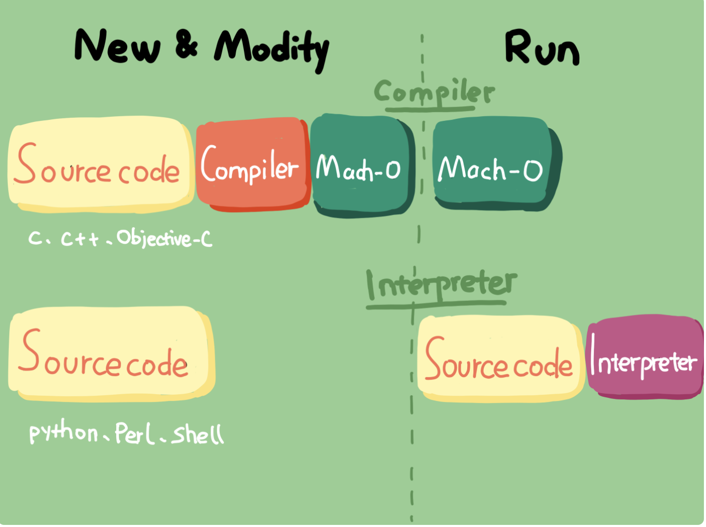

## 05 | 链接器：符号是怎么绑定到地址上的？

##### 1.编译器和解析器

+ 编译器将编写的代码编译成机器码，然后直接在 CPU 上执行机器码。
+ 解释器：运行时解释执行码，获取一段代码后就会将其翻译成目标代码（就是字节码（Bytecode）），然后一句一句地执行目标代码。

|          | 编译器   | 解释器   |
| :------- | -------- | -------- |
| 工作方式 | 编译时期 | 运行时期 |
| 效率     | 高       | 低       |
| 动态功能 | 否       | 是       |

两者过程处理对比图：

##### 2.iOS中的连接器

2.1 作用

就是完成变量、函数符号和其地址绑定这样的任务。而这里我们所说的符号，就可以理解为变量名和函数名。

2.2 连接器会将所有 Mach-O 文件合并成一个，这个过程如下：

+ 查找目标文件有没有定义变量
+ 将不同目标文件中的符号定义和引用地址收集起来，存放于全局符号列表中
+ 计算合并长度及位置，生成同类型的段进行合并，建立绑定
+ 对项目中不同文件里的变量进行地址重定位

2.2 动态连接器

[ld & dyld](<https://stackoverflow.com/questions/29335332/does-os-x-have-two-linkers-one-static-and-one-dynamic>)

##### 3.如何决定链接器加载动态库的方式？

使用 dyld(动态连接器) 加载动态库，有两种方式：

+ 有程序启动加载时绑定
+ 符号第一次被用到时绑定。

4.dlopen 和 dlsym
dlopen:获取动态库，并获得引用指针
dlsym:根据 dlopen 返回的动态库指针和函数符号，获取函数的地址并执行。

5.executing mach-ofile 

 The process of loading and linking a program in OS X mainly involves two entities: the OS X kernel and the dynamic linker. When you execute a program, the kernel creates a process for the program, and loads the program and the dynamic linker shared library, usually `/usr/lib/dyld`, in the program’s address space. The kernel then executes code in the dynamic linker that loads the libraries the program references. This article also describes the visibility symbols in a module get depending on how they are defined and the process of resolving symbol references at runtime.
