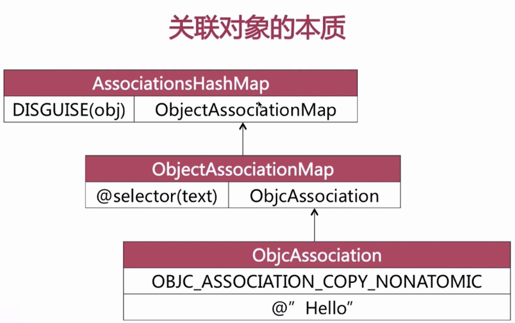
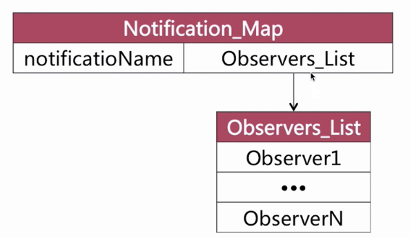

#OC 基础知识

## 成员变量 实例变量 属性 

#####1.1 概念

**成员变量**：通常是指向对象或是基础类型（int, float）的简单指针。可以在.h 或是 .m 文件中声明：

```objective-c
// header (.h)
@interface Food : NSObject {
   NSNumber *someIvar;
   CGFloat otherIvar;
}
@end

//implementation file (.m) 
@interface Food () {
    NSNumber *someIvar;
    CGFloat otherIvar;
} 
@end
//或是
@implementation Food {
    NSNumber *someIvar;
    CGFloat otherIvar;
} 
@end
```

**实例变量**：是成员变量的一种，实例是针对类而言的，是指对类的声明；由此推理，实例变量是指由类声明的对象。

**属性**：GCC 到 LLVM（low level virtual machine），编译器自动为属性添加成员变量，规则：_属性名。如果需要自定义成员变量的名字，可以使用@synthesizer实现。

#####1.2 那么什么时候使用属性？什么时候使用成员变量呢？

​	属性是增加 IPA 的体积，通过 clang 查看，每添加一个属性，编译器会自动添加两个方法，如果使用没有必要的属性，自然会增大 IPA 体积的。所以不用对外开放的变量和内部不需要懒加载的情况，尽量使用成员变量。

https://www.jianshu.com/p/f7b434534389

https://www.jianshu.com/p/55f781f8c915

##分类 Category

#####2.1 基本概念

**运用于**：声明私有办法，分解体积庞大的类文件，把Framework的私有办法公开。

**特点**：运行时决议（运行时才把内容添加进去），可以为系统类添加分类。

**添加那些内容**：实例办法，类办法，协议，属性（只是声明了setter & getter,并没有在分类中添加实例变量，【可以通过关联对象添加实例变量】）。

**分类的结构体**：

````objective-c
typedef struct category_t {
    const char *name;
    classref_t cls;
    struct method_list_t *instanceMethods;
    struct method_list_t *classMethods;
    struct protocol_list_t *protocols;
    struct property_list_t *instanceProperties;
} category_t;
````

#####2.2 加载调用栈：

```objective-c
_objc_init
└──map_2_images
    └──map_images_nolock
        └──_read_images
            └──_remethodizeClass
```

分类加载的调用栈如上述

-  `_objc_init` 算是整个 objc4 的入口，进行了一些初始化操作，注册了镜像状态改变时的回调函数
-  `map_2_images` 主要是加锁并调用 `map_images_nolock` ，加载内存镜像相关内容
-  `map_images_nolock` 在这个函数中，完成所有 class 的注册、fixup等工作，还有初始化自动释放池、初始化 side table 等工作并在函数后端调用了 `_read_images` 
-  `_read_images` 方法干了很多苦力活，比如加载类、Protocol、Category，加载分类的代码就写在 `_read_images` 函数的尾部

该调用栈入口函数 `void _objc_init(void)` 在 `objc-os.mm` 中，有兴趣的同学可以去看看这些函数里都做了什么

#####2.3 窥探源码：

使用 clang 命令看看 category 到底变成什么?

```objective-c
//show me the code
```

1)、还有一个需要注意到的事实就是category的名字用来给各种列表以及后面的category结构体本身命名，而且有static来修饰，所以在同一个编译单元里我们的category名不能重复，否则会出现编译错误。

2)、其次，编译器生成了category本身*OBJC*$_CATEGORY*MyClass*$_MyAddition，并用前面生成的列表来初始化category本身。


根据调用栈，我们在`objc-runtime-new.mm`文件的 `_read_images` 末尾找到一段关于分类的代码：

```objective-c
// Discover categories. 
    for (EACH_HEADER) {
        category_t **catlist = 
            _getObjc2CategoryList(hi, &count);
        bool hasClassProperties = hi->info()->hasCategoryClassProperties();

        for (i = 0; i < count; i++) {
            category_t *cat = catlist[i];
            Class cls = remapClass(cat->cls);

            if (!cls) {
                // Category's target class is missing (probably weak-linked).
                // Disavow any knowledge of this category.
                catlist[i] = nil;
                if (PrintConnecting) {
                    _objc_inform("CLASS: IGNORING category \?\?\?(%s) %p with "
                                 "missing weak-linked target class", 
                                 cat->name, cat);
                }
                continue;
            }

            // Process this category. 
            // First, register the category with its target class. 
            // Then, rebuild the class's method lists (etc) if 
            // the class is realized. 
            bool classExists = NO;
            if (cat->instanceMethods ||  cat->protocols  
                ||  cat->instanceProperties) 
            {
                addUnattachedCategoryForClass(cat, cls, hi);
                if (cls->isRealized()) {
                    remethodizeClass(cls);
                    classExists = YES;
                }
                if (PrintConnecting) {
                    _objc_inform("CLASS: found category -%s(%s) %s", 
                                 cls->nameForLogging(), cat->name, 
                                 classExists ? "on existing class" : "");
                }
            }

            if (cat->classMethods  ||  cat->protocols  
                ||  (hasClassProperties && cat->_classProperties)) 
            {
                addUnattachedCategoryForClass(cat, cls->ISA(), hi);
                if (cls->ISA()->isRealized()) {
                    remethodizeClass(cls->ISA());
                }
                if (PrintConnecting) {
                    _objc_inform("CLASS: found category +%s(%s)", 
                                 cls->nameForLogging(), cat->name);
                }
            }
        }
    }
```

遍历分类，找出所属的类，类所对应的分类（名）


##### 2.4 源码后，如何解决问题

如何避免分类重复名呢？

​	为分类添加前缀。

如何避免分类方法被“覆盖”？

​	为其添加前缀，格式前缀_方法名。- (void) mrs_oneMethodForCategory; 

#####2.5 总结：

（1）分类添加的办法可以“覆盖”原类办法，实则各个类别的办法依然存在办法列表中。

（2）同名分类办法谁能生效取决于编译顺序

（3）名字相同的分类会引起编译报错

## 关联对象

**作用**：为分类添加“成员变量”

**两个重要函数**：obj_getAssociatedObject

**关联对象的本质**：

关联对象由 AssociationsManager 管理并在 AssiciationsHashMap 存储。所有对象的关联内容都在同一个全局容器中。




## 扩展 （Extension）

**定义**：也称匿名分类，官方解释：Because no name is given in the parentheses, class extensions are often referred to as anonymous categories.（因为在括号里面没有名字，古称为匿名分类）

```objective-c
//implementation file (.m) 
@interface className () 
@end
```

**作用**：声明私有属性，声明私有办法，私有成员变量

**特点**：编译时决议

​	   只以声明的形式存在，多数情况下寄生于宿主类的.m中

​           不能为系统类添加扩展

## 代理

软件设计模式

传递方式：一对一

三角关系：代理方，协议（办法，属性），委托方

循环引用：


代理方：主动

委托方：被动

## 通知

特点：使用观察者模式来实现的用于跨层传递消息的机制

​	    传递方式为一对多

如何实现通知机制？（没有源代码）




## KVO

什么是？ OC 对观察者模式的又一实现； Apple 使用了 isa 混写(isa-swizzling) 来实现KVO.

原理：


本质是两个办法：willChangeValueForPathkey, DidChangeValueForPathkey

总结：

使用setter方法改变值KVO生效

使用setValue:forKey：改变值KVO生效

成员变量直接修改需手动添加KVO才会生效（即是本质的两个关键办法）

## KVC

是一种键值对设计模式，破坏面对对象的编程思想。

_key

_isKey

key

isKey


## 属性关键字

读写权限

+ readonly
+ readwrite

引用计数

+ retain / strong

+ weak / assign

  assign:

  修饰基本数据类型，如int, bool等

  修饰对象类型时，不改变其引用计数

  会产生悬垂指针：仍然指向内存地址，如果没覆盖后还调动变量就会crash

  weak：

  不改变修饰对象的引用计数

  所指对象在释放之后会自动设置为nil

+ copy

  |    name    | 浅拷贝 | 深拷贝 |
  | :--------: | :----: | :----: |
  | 新内存空间 | 不分配 |  分配  |
  |  引用计数  |  影响  | 不影响 |

|  源对象类型   |  拷贝方式   | 目标对象类型 | 拷贝类型 |
| :-----------: | :---------: | :----------: | :------- |
|  mutable对象  |    copy     |    不可变    | 深拷贝   |
|  mutable对象  | mutableCopy |     可变     | 深拷贝   |
| immutable对象 |    copy     |    不可变    | 浅拷贝   |
| immutable对象 | mutableCopy |     可变     | 深拷贝   |

原子问题

+ atomic ：赋值和获值

+ nonatomic

