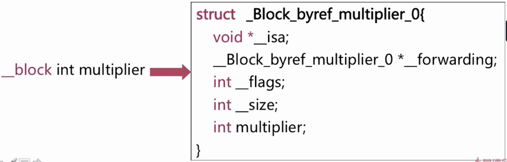
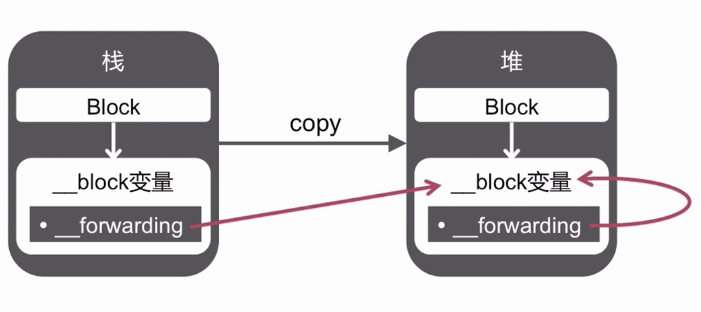

## block

####block 介绍

block 是将函数及其执行上下文封装起来的**对象**。

如何编译文件 如何打开？

``clang -rewrite-objc file.m``


####截获变量

局部变量：基本数据类型，对象类型

+ 基本类型：对于基本数据类型的局部变量获取其值
+ 对于对象类型的局部变量连同所有权修饰符一起截获

静态局部变量 ： 以指针形式截获局部静态变量

全局变量：不截获

静态全局变量：不截获


编译命令:  ``clang -rewrite-objc  -fobjc-arc file.m``

####__block修饰

一般情况下，对被截获变量进行赋值操作需要添加 __block 修饰符

需要：局部变量（基本类型，对象类型）

不需要：静态局部变量，全局变量，静态全局变量


__block 修饰后变成了什么？

修饰的变量变成了对象：如下




```objective-c
__block int val = 10;

//转换成

__Block_byref_val_0 val = {
    0,
    &val,
    0,
    sizeof(__Block_byref_val_0),
    10
};
```

会发现一个局部变量加上**block修饰符后竟然跟block一样变成了一个**Block_byref_val_0结构体类型的自动变量实例！！！！

此时我们在block内部访问val变量则需要通过一个叫**forwarding的成员变量来间接访问val变量(下面会对**forwarding进行详解)

摘：[iOS Block详解](https://imlifengfeng.github.io/article/457/)

####block 的内存管理（栈和堆）

block 的 copy 操作

|       block 类别       |   源   |  Copy 结果   |
| :--------------------: | :----: | :----------: |
| _NSConcreteStackBlock  |   栈   |      堆      |
| _NSConcreteGlobalBlock | 数据区 |  什么也不做  |
| _NSConcreteMallocBlock |   堆   | 增加引用计数 |

如何判断 block 的类别呢？

（1）Block不访问外界变量（包括栈中和堆中的变量）

Block 既不在栈又不在堆中，在代码段中，ARC和MRC下都是如此。此时为全局块。

（2）Block访问外界变量

MRC 环境下：访问外界变量的 Block 默认存储**栈**中。
ARC 环境下：访问外界变量的 Block 默认存储在**堆**中（**实际是放在栈区，然后ARC情况下自动又拷贝到堆区**），自动释放。


栈类型



#####循环引用

+ 截获变量
+ __block 修饰变量


Readmore：

[Working with Blocks](https://developer.apple.com/library/archive/documentation/Cocoa/Conceptual/ProgrammingWithObjectiveC/WorkingwithBlocks/WorkingwithBlocks.html#//apple_ref/doc/uid/TP40011210-CH8-SW1)

[Blocks and Grand Central Dispatch in Practice](https://developer.apple.com/videos/play/wwdc2011/308/)