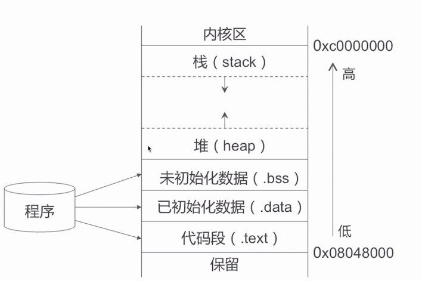
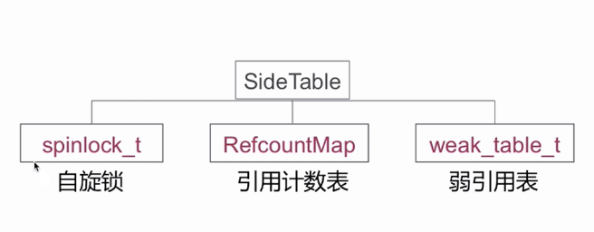
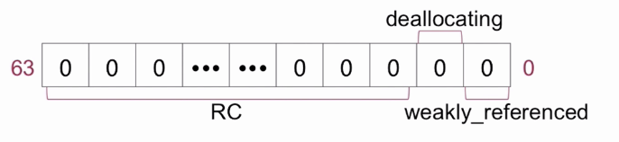
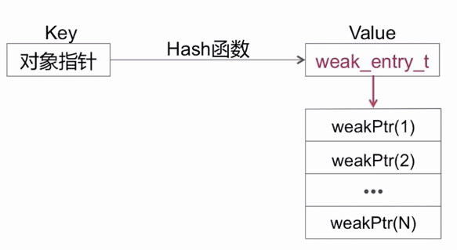
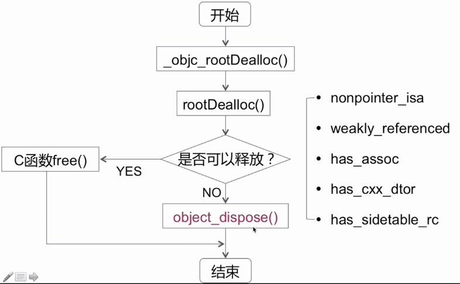
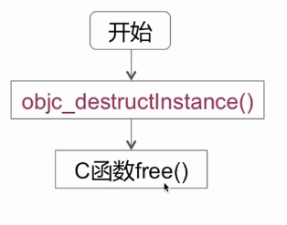
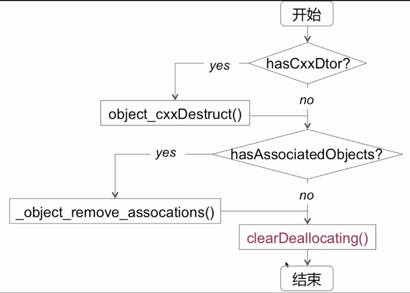
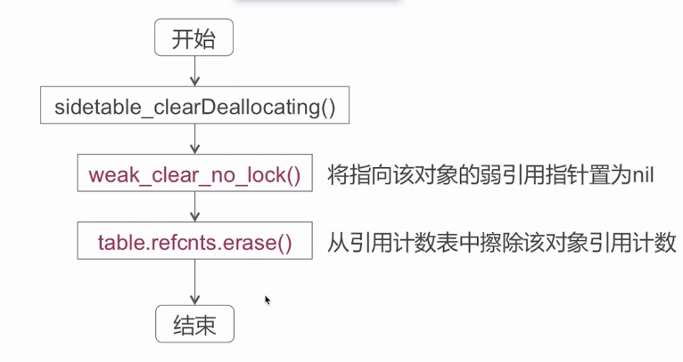
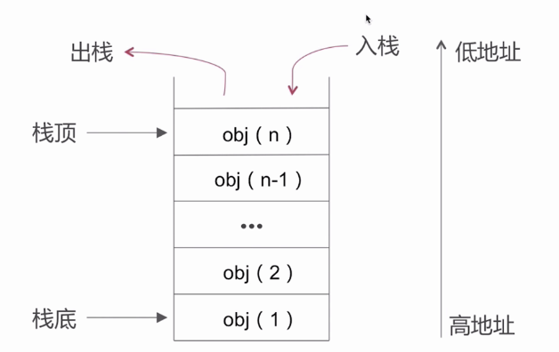

#内存

#### 内存布局

栈：办法调用

堆：通过alloc等分配的对象（block copy）

bss: 未初始化的全局变量等

data：已初始化的全局变量等

text：程序代码

#### 内存管理方案

+ TaggedPointer
+ NONPOINTER_ISA（非指针型的ISA）
+ 散列表 Side Tables（复杂的数据结构，弱引用表和引用计数表）

比特位

Side Tables结构

 

下一步：了解哈希表（算法章节）

#### 数据结构

Spinlock_t 自旋锁

是“忙等”的锁，适用于轻量访问。

RefcountMap 

引用计数表 哈希查找

要往后移动两位，才能取到真实的值

weak_table_t

弱引用表

#### ARC & MRC

arc:

+ LLVM 和 Runtime 协作的结果（runtime是如何协作的？）
+ 禁止手动调用ratain/release/reatainCount/dealloc 
+ 新增weak,strong属性关键字

#### 引用计数

retain

release

retainCount

dealloc 的实现流程

object_dispose

objc_destructInstance

clearDeallcating

#### 弱引用

#### 自动释放池

+ 是以栈为结点通过双向链表的形式组合而成
+ 是和线程一一对应的。

栈

+ 在当次 runloop 将要结束的时候调用 AutorealsePoolPage::pop()
+ 多层嵌套即是多次插入哨兵对象
+ 在 for 循环中 alloc 图片数据等内存消耗较大的场景手动插入 autoreleasePool 

#### 循环引用

类型：

+ 自循环引用
+ 相互循环引用
+ 多循环引用

考点

+ 代理（相互循环）
+ block
+ NSTimer
+ 大环引用

如何破除？

+ 避免循环
+ 在合适的时机手动断环

具体解决方案？

+ __weak
+ __block
+ __unsafe_unretained (悬挂指针危险)

ps :__block

+ MRC下，被修饰的对象不会增加其引用计数，避免了循环引用
+ ARC下，被修饰的对象会被强引用，无法避免循环引用，需手动解环

