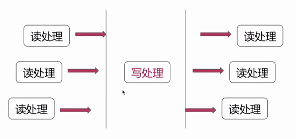
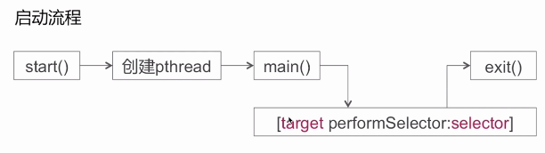

# 多线程

## GCD

####同步/异步 和 串行/并发

|      | 同步 | 异步 |
| :--: | ---- | ---- |
| 串行 |      |      |
| 并行 |      |      |

死锁原因 ： 队列引起的循环等待

GCD 所维护的线程池，在默认的情况下是没有开启 runloop 的。

####dispatch_barrier_async

实现多读单写？

+ 读者，读者并发
+ 读者，写者互斥
+ 写者，写者互斥

异步栅栏的方式

####dispatch_group_async

使用 GCD 实现需求：A,B,C 三个任务并发，完成后执行任务 D。

## NSOpertation

需要和NSOperationQueue配合使用来实现多线程方案

+ 添加任务依赖
+ 任务执行状态控制
+ 最大并发量

任务执行状态：

+ isReady
+ isExecuting
+ isFinished
+ isCancelled

状态控制

+ 如果重写了main方法，底层控制变更任务执行完成状态，以及任务退出。
+ 如果重写了start方法，自行控制任务状态。

系统是怎样移除一个isFinished = YES 的 NSOpertation 的?

+ KVO (willChanged...didChanged)

## NSThread

  

## 多线程和锁

iOS 当中都有哪些锁？

+ NSRecursiveLock
+ NSLock
+ dispatch_semaphore_t

@synchronized：一般在创建单例对象的时候使用

atomic：修饰属性的关键字，对修饰对象进行原子操作（不负责使用）

OSSpinLock:循环等待询问，不释放当前资源

用于轻量级数据访问，简单的int值 +1 / -1 操作

NSLock

