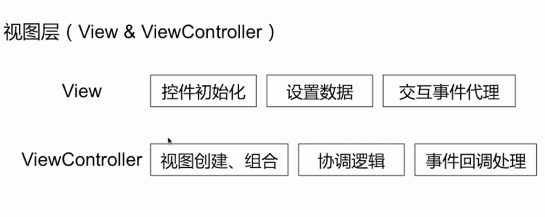

# 框架

+ 模块化

+ 分层

+ 解耦

  

## 图片缓存

怎样设计一个图片缓存框架？

整体框架（多级缓存）

图片是通过什么样的方式进行读写，过程是怎样的？

+ 以图片URL的单向Hash值作为key

内存设计上需要考虑哪些问题？

+ 存储大小

  

+ 淘汰策略

  存储大小

  淘汰策略

  + 先进先出
  + LRU算法（最近最久未使用）

磁盘设计需要考虑哪些问题？

+ 存储方式
+ 大小限制（如100BM）
+ 淘汰策略（如某一图片存储时间距今超过7天）

网络部分设计需要考虑哪些问题？

+ 图片请求最大的并发量
+ 请求超时策略
+ 请求优先级

对于不同格式的图片，解码采用什么方式来做？

+ 应用策略模式对不同格式进行解码

在那个阶段做图片解码处理？

+ 磁盘读取后
+ 网络请求返回后

## 阅读时长统计

记录的数据会由于某些原因丢失，你是怎么处理的？（降低数据丢失率）

+ 定时写磁盘
+ 限定内存缓存条数，超过规定条数，即写磁盘

关于延时上传的具体场景有哪些？

+ 前后台切换
+ 从无网到有网的变化

## 复杂页面架构

整体架构

视图层级

业务逻辑

数据层

数据流 

## 客户端整体架构

业务之间的解耦

+ OpenURL

+ 依赖注入

  