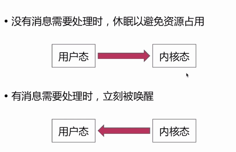
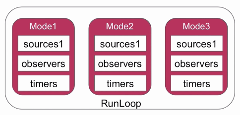
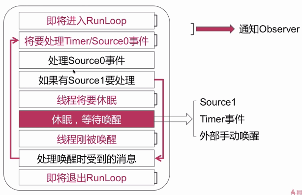
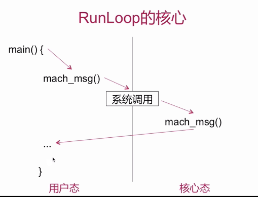

# Runloop

## 概念

是通过内部维护的事件循环来对事件 / 消息进行管理的一个对象。

事件循环：

+ 没有消息需要处理时，休眠以避免资源占用 
+ 有消息需要处理时，立刻被唤醒




main 函数为什么不退出？

在main函数中调用的UIApplicationMain 这样一个函数，会启动主线程的 Runloop，而 runloop 又是对事件循环的一种维护机制，在没事情做的时候做事，没事做的时候可以从用户态切换到内核态的一个切换，避免资源的占用，使当前线程处于休眠状态。 整个过程就是接收消息, 处理,等待（状态切换）。

## 数据结构

NSRunloop 是 CFRunloop 的封装，提供了面向对象的 API.

+ CFRunLoop
+ CFRunLoopMode
+ Source / Timer / Observer


CFRunLoop

>pthread : 一一对应（RunLoop 和线程的关系）
>
>currentMode ： CFRunLoopMode
>
>modes ： NSMutableSet<CFRunLoopMode *>
>
>commonModes :  NSMutableSet<NSString *>
>
>commoModeltems :  多个 Source / Timer / Observer


CFRunLoopMode

>name :  NSDefaultRunLoop Mode 
>
>sources0 : MutableSet
>
>sources1: MutableSet
>
>observers: MutabeArray
>
>timers : MutabeArray

``content``：Although the names you assign to custom modes are arbitrary, the contents of those modes are not. You must be sure to add one or more input sources, timers, or run-loop observers to any modes you create for them to be useful.

``function``:You use modes to filter out events from unwanted sources during a particular pass through your run loop. 


Source

>sources0 :  需要手动唤醒线程
>
>sources1 :  具备唤醒线程的能力

Port-based input sources monitor your application’s Mach ports. Custom input sources monitor custom sources of events. 

The only difference between the two sources is how they are signaled. Port-based sources are signaled automatically by the kernel, and custom sources must be signaled manually from another thread.


Timer

>基于事件的定时器，和 NSTimer 是 toll-free bridged 的。


Observer

>观测时间点：
>
>+ kCFRunLoopEntry
>+ kCFRunLoopBeforeTimers
>+ kCFRunLoopBeforeSources
>+ kCFRunLoopBeforeWaiting
>+ kCFRunLoopAfterWaiting
>+ kCFRunLoopExit


数据结构之间的关系


RunLoop 的 Mode



一个 Runloop 可以对应多个 mode，一个mode可以对一个多个 Source / Timer / Observer； 当runloop运行在某一个mode上面的时候，只专注于处理该mode上的事件，而屏蔽了其他mode的事件。例如runloop运行在mode1上面，这时候如果mode2的Observer/Timer 回调了，runloop并不能处理。


一个 timer 如何添加到一个mode上？

commonMode

+ commonMode 不是实际存在的一种 mode
+ 是同步 Source / Timer / Observer到多个mode的一种技术方案

 

## 事件循环机制

void CFRunLoopRun()

在runloop启动之后，会发送一个通知来告知观察者当前runloop即将启动；之后runloop将要处理time/sources0事件，之后正式进入sources0事件的处理。然后呢如果有sources1事件要处理，那么通过一条goto语句来进行代码逻辑的跳转，处理唤醒时接收到消息。如果没有sources1处理的话，线程将要休眠，同时也会发送通知给observer，这时就发生了用户态到内核态的一个切换，线程就正式进入了休眠，等待被唤醒；然而唤醒线程的相关条件有：sources1，Timer事件，外部手动唤醒。线程唤醒了也会向observer发送唤醒通知。线程唤醒后又回到将要处理time/sources0事件。如果将程序杀死后，会发送即将推出runloop的通知。runloop推出后，线程也就被销毁掉了。




1. Notify observers that the run loop has been entered.
2. Notify observers that any ready timers are about to fire.
3. Notify observers that any input sources that are not port based are about to fire.
4. Fire any non-port-based input sources that are ready to fire.
5. If a port-based input source is ready and waiting to fire, process the event immediately. Go to step 9.
6. Notify observers that the thread is about to sleep.
7. Put the thread to sleep until one of the following events occurs:
   - An event arrives for a port-based input source.
   - A timer fires.
   - The timeout value set for the run loop expires.
   - The run loop is explicitly woken up.
8. Notify observers that the thread just woke up.
9. Process the pending event.
   - If a user-defined timer fired, process the timer event and restart the loop. Go to step 2.
   - If an input source fired, deliver the event.
   - If the run loop was explicitly woken up but has not yet timed out, restart the loop. Go to step 2.
10. Notify observers that the run loop has exited.


runloop核心



## Runloop 与 NSTimer

问题：滑动 TableView 的时候我们的定时器还会生效吗？

不会。当前运行是在 kCFRunLoopDefaulfMode, 当滑动的时候，发生Mode切换，变成UITrackingRunLoopMode.

如何解决？

```objective-c
void CFRunLoopAddTimer(runloop, timer , commonMode);
//把 timer 添加到多个mode
```


## Runloop 与多线程

线程是和Runloop一一对应的。

自己创建的线程默认是没有runloop的，需要手动创建。

如何实现一个常驻线程？

+ 为当前线程开启一个RunLoop
+ 向该RunLoop中添加一个Port/Source等待维持RunLoop的事件循环
+ 启动该RunLoop


### PerformSelecter

当调用 NSObject 的 performSelecter:afterDelay: 后，实际上其内部会创建一个 Timer 并添加到当前线程的 RunLoop 中。所以如果当前线程没有 RunLoop，则这个方法会失效。

当调用 performSelector:onThread: 时，实际上其会创建一个 Timer 加到对应的线程去，同样的，如果对应线程没有 RunLoop 该方法也会失效。


readMore：

[NSRunLoop](https://developer.apple.com/documentation/foundation/nsrunloop?language=objc)

[Threading Programming Guide for RunLoop](https://developer.apple.com/library/archive/documentation/Cocoa/Conceptual/Multithreading/RunLoopManagement/RunLoopManagement.html#//apple_ref/doc/uid/10000057i-CH16-SW1)

[深入理解RunLoop](https://blog.ibireme.com/2015/05/18/runloop/)

