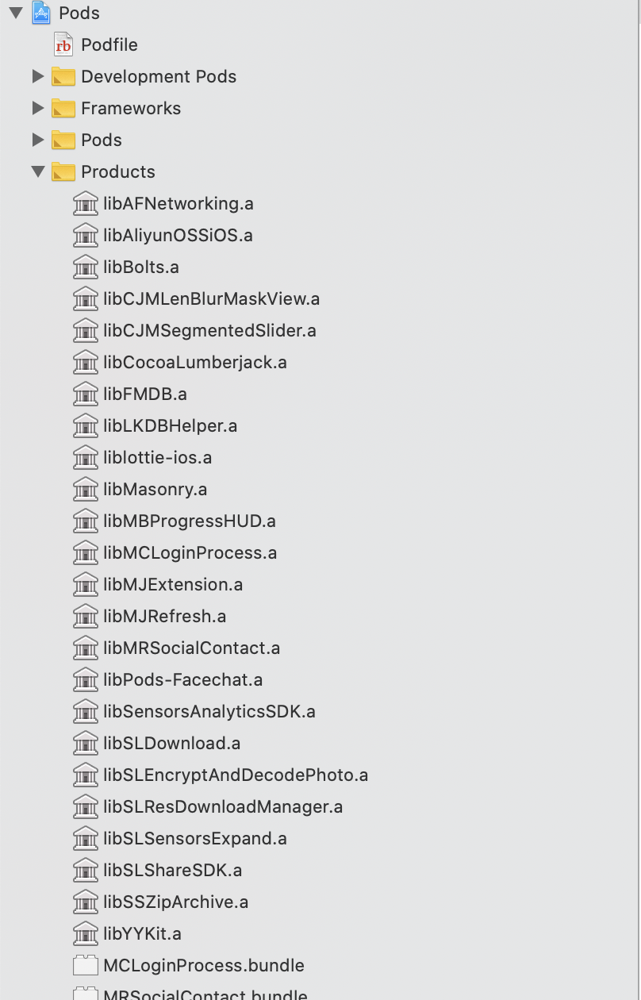
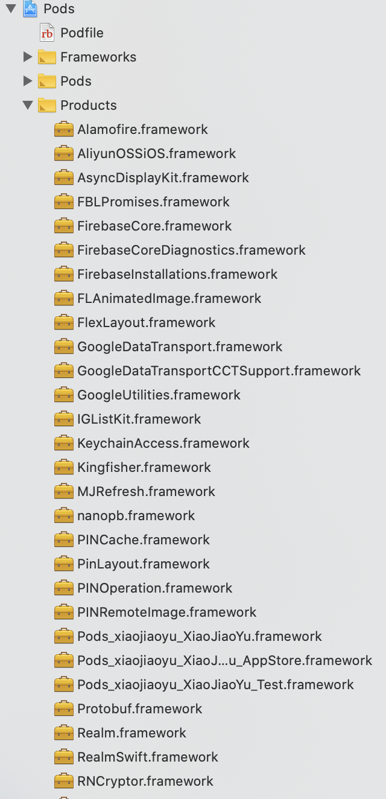

Cocoapod 

##### 1.pod 进来的库是静态库还是动态库

OC 项目 pod 进来的库默认是静态库（不使用 use_frameworks），所以在项目的 Pod/Product 文件下可以看到所 pod 进来库是.a格式

Swift 项目使用 `use_frameworks!`, 所以在项目的 Pod/Product 文件下可以看到所 pod 进来库是.framework 格式

"`use_frameworks!` tells cocoa pods to use dynamic libraries, and was very prevalent at one point due in particular to swift not supporting static libraries, meaning there was no choice - however you often **don't** need `use_frameworks!` anymore.

As of Xcode 9 beta 4, and CocoaPods 1.5.0, swift static libraries are now supported. The main advantage is faster app startup times, particularly if you have a lot of pods - iOS 10 and 11 are not the fastest when you have many dylibs."