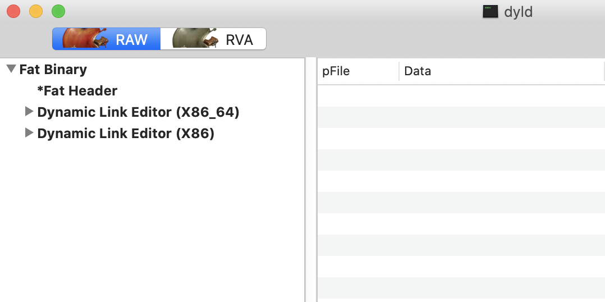

Mach-O 文件

##### 1.文件类型

+ executable: 应用的主要二进制文件
+ Dylib：动态库
+ bundle：也是一种dylib,不过不能来直接链接，需要使用`dlopen()`
+ image: 可以是executable，Dylib，bundle中任意一种
+ framework：一种 dylib,有着特别的目录框架

##### 2.结构设计优点

+ 当不同进程加载Mach-O，对于已经加载到RAM缓冲区的`_TEXT` ,`_LINKEDIT` ，不同进程之间可以共享。对于`_DATA`，不同进程使用cope-on-write,各自拥有

+ 使用`mmap()`加载需要的 segment

+ 权限保障了安全性：只读，可读写，可执行

  

  

  

##### 3.Mach-O Universal File

[FAT 二进制](https://en.wikipedia.org/wiki/Fat_binary)文件，将多种架构的 Mach-O 文件合并而成.

通过MachOView查看`/usr/lib/dyld`

