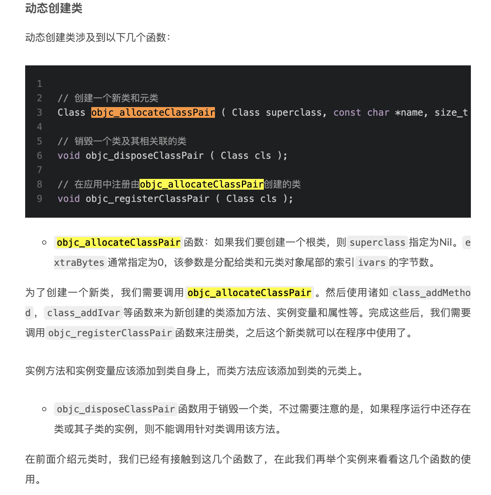
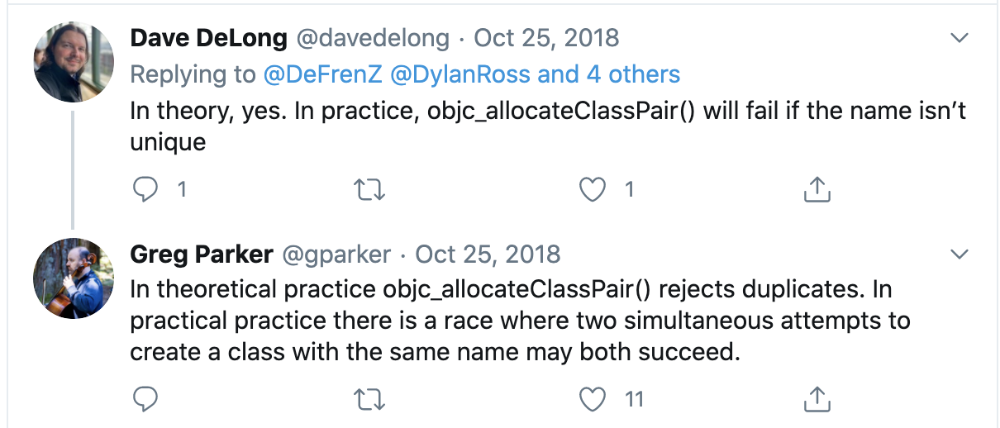

#### Runtime 知识

##### 1.结构体

```objective-c
typedef struct objc_class *Class;
typedef struct objc_object *id;

@interface Object { 
    Class isa; 
}

@interface NSObject <NSObject> {
    Class isa  OBJC_ISA_AVAILABILITY;
}

struct objc_object {
private:
    isa_t isa;
}

struct objc_class : objc_object {
    // Class ISA;
    Class superclass;
    cache_t cache;             // formerly cache pointer and vtable
    class_data_bits_t bits;    // class_rw_t * plus custom rr/alloc flags
}

union isa_t {
    isa_t() { }
    isa_t(uintptr_t value) : bits(value) { }
    Class cls;
    uintptr_t bits;
}
```

https://www.jianshu.com/p/fd7aad6297f0

##### 2.Objective-C 是一个动态语言，这意味着它不仅需要一个编译器，也需要一个运行时系统来动态得创建类和对象、进行消息传递和转发。

##### 3.类方法和实例方法的传递过程

调用实例方法，会根据当前对象的isa指针找到对应的类的实例方法；如果没有查找到，就顺应着superclass找到父类，遍历父类中的实例方法，以此类推到根类去查找同名实例方法，如果根类还是查找不到，就进行消息转发。

调用类方法，通过类的isa指针找到元类对象，顺次查找到根元类对象，**再到根类对象**，最后到nil.

##### 4.动态添加办法

实例办法：直接添加在类上

```objective-c
Class class = NSClassFromString(@"UIGroupTableViewCellBackground");
NSAssert(class_addMethod(class, @selector(layerClass), (IMP)my_layerClass, "@:@"), nil);
```

类办法：添加在元类上

```objective-c
Class metaclass = object_getClass(NSClassFromString(@"UIGroupTableViewCellBackground"));
NSAssert(class_addMethod(metaclass, @selector(layerClass), (IMP)my_layerClass, "@:@"), nil);
```

##### 5.元类

5.1元类是什么？

正如类是对象的类一样，元类就是类对象的类。对象的isa指向类，类对象的isa指向元类。

5.2为什么需要元类？

元类非常重要，它存储着类对象的类方法，正如类存储着对象的实例方法一样。每个类必须有一个元类，因为每个类可能都有独一无二的类方法列表。这样是为了保持设计一致性，所以出现元类。

5.3元类的类是什么？元类的继承关系？

所有元类的的类都是一样的，都是指向根元类，所以基类的元类的类也是他本身。更奇怪的是，基类的元类的超类指向基类本身，这就意味着基类的元类拥有其类方法和基类的所有实例方法。

5.4元类的超类

元类同样有一个指针指向它的superclass，不过基类的元类的超类是指向基类。

##### 6.动态创建类

6.1创建类的时候，同时也在创建该类的元类

##### 

6.2可能遇到的问题：



##### 7.class 方法

```objective-c
+ (Class)class {
    return self; // 返回自身指针 (类 / 元类)
}

- (Class)class {
    return object_getClass(self); // 调用'object_getClass'返回isa指针
}

Class object_getClass(id obj) {
    return _object_getClass(obj);
}

//object_getClass实际调用的是_object_getClass函数，我们接着看其实现:

static inline Class _object_getClass(id obj) {
    #if SUPPORT_TAGGED_POINTERS
    if （OBJ_IS_TAGGED_PTR(obj)）{
        uint8_t slotNumber = ((uint8_t)(uint64_t) obj) & 0x0F;
        Class isa = _objc_tagged_isa_table[slotNumber];
        return isa;
    }
    #endif
        if (obj) return obj->isa;
        else return Nil;
}
```

##### 8.相关博文

[神经病院 Objective-C Runtime 入院第一天—— isa 和 Class](https://halfrost.com/objc_runtime_isa_class/)

[神经病院 Objective-C Runtime 住院第二天——消息发送与转发](https://halfrost.com/objc_runtime_objc_msgsend/)

[神经病院 Objective-C Runtime 出院第三天——如何正确使用 Runtime](https://halfrost.com/how_to_use_runtime/)

[格物致知iOS系列之类与对象](https://www.imooc.com/article/70985)

[结合 category 工作原理分析 OC2.0 中的 runtime](https://twitter.com/intent/tweet?text=结合 category 工作原理分析 OC2.0 中的 runtime "&hashtags=&url=https://bestswifter.com/runtime-category/)

[深入理解Objective-C：Category](https://tech.meituan.com/2015/03/03/diveintocategory.html)

